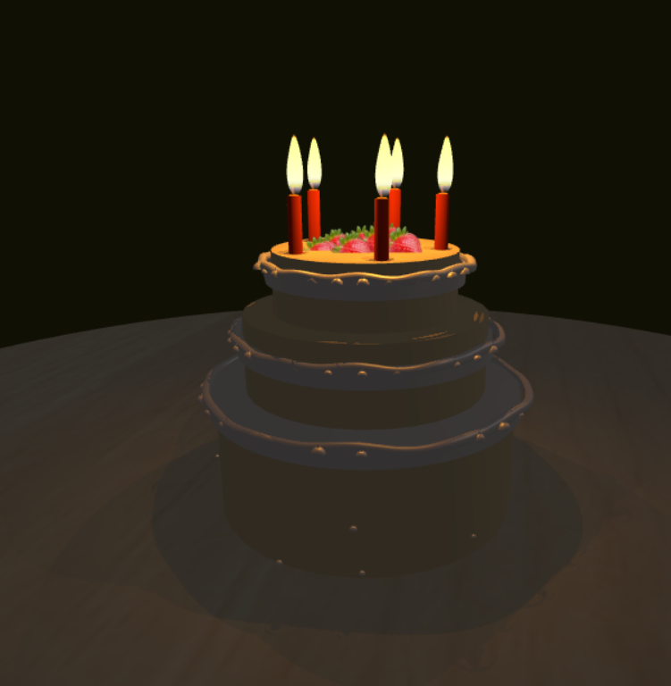

# 🎂 Three.js 3D Birthday Cake Surprise

A beautiful and interactive web-based birthday celebration featuring a **realistic 3D cake** built with **Three.js**!🎈
---

This project delivers a fully personalized birthday experience: users enter their name, listen to the classic "Happy Birthday" song, and then blow out the 3D cake candles by actually blowing into the microphone (or holding the screen)!🎤
---

## ✨ Features

- **Realistic 3D birthday cake** created with Three.js
- **Full personalization**: Enter your name, which appears in the final congratulatory message
- **Happy Birthday song playback** with a 38-second countdown timer
- **Real blow detection** using the microphone (Web Audio API)
- **Mobile support**: Hold/touch the screen to blow out candles
- **Guided experience**: Reminders to turn up volume, wait until song ends, and how to blow
- **Stunning animations & effects**: Particles, lighting, shadows, and festive visuals
- **Responsive design** with a warm red-orange-black theme
- **No server required** – Pure client-side, perfect for hosting on GitHub Pages or any static host
---

## 🖼️ Demo / Screenshot




---

**Live Demo**:
https://yourusername.github.io/three-js-birthday-cake)

---

## 🚀 How to Run Locally

1. Clone the repository:
   ```bash
   git clone https://github.com/YALDAKHOSHPEY/three-js-birthday-cake.git
   
   ---

## Development

1. Clone the repository
2. Install dependencies with `yarn`
3. Run the project with `yarn dev`
---
## Credits

- [The Lonely Candle Codepen](https://codepen.io/prisoner849/pen/XPVGLp)
- [Happy Birthday song (YouTube)](https://www.youtube.com/watch?v=aF8voKa_3Us)
---

## 📱📝 Tips for the Best Experience

- **Turn up your volume** to fully enjoy the song and sound effects.
- To **blow out the candles**:
  - On desktop: Blow strongly and briefly near your microphone (like real candles!)
  - On mobile: Long-press (hold) anywhere on the screen
- Use modern browsers: Chrome, Edge, or Firefox recommended.

## 🛠️ Technologies Used

- **Three.js** – 3D rendering of the cake and candles
- **Web Audio API** – Real-time blow detection via microphone
- **HTML5 Audio** – Playing the birthday song
- **Vanilla JavaScript** – No frameworks
- **Modern CSS** – Animations and responsive layout

## 🎨 Color Theme

Current theme: **Rich red, warm orange, and deep black** – creates a passionate and festive vibe  


## 👤 Personalization

The entered name is displayed in the final message:  
**"Happy Birthday, [Your Name]!"**

## 📂 Project Structure

- `index.html` – Main page
- `style.css` – Beautiful styling with red-orange theme
- `script.js` – Core logic (Three.js scene, blow detection, candle animation)
- `happy-birthday.mp3` – Birthday song (in root or public folder)
- `public/` – Icons, images, and static assets
- `screenshot/` – Project screenshot

## 📄 License

This project is licensed under the **MIT License** – see the [LICENSE](LICENSE) file for details.

## 🔗 Repository

https://github.com/YALDAKHOSHPEY
